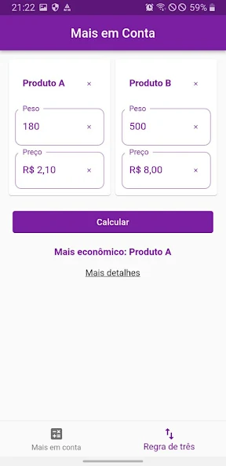
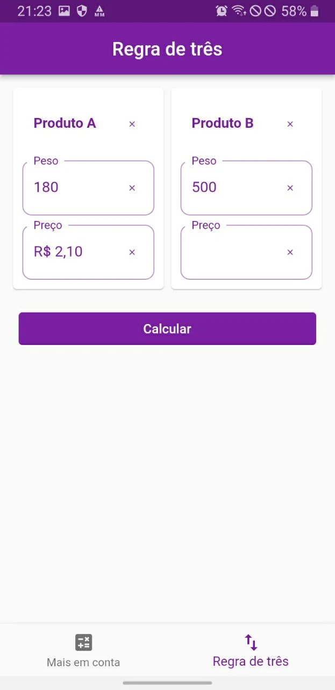
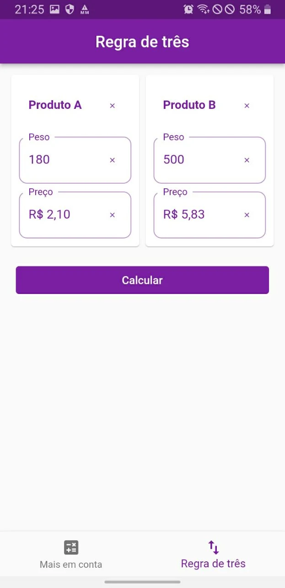

    

### Sobre
Mais em Conta é um aplicativo que ajuda o usuário a encontrar produtos mais econômicos, comparando o peso e o preço de diferentes itens com base no preço por unidade de medida, como quilograma. Além disso, o app inclui uma calculadora de regra de três para facilitar ainda mais os cálculos.

Clique no link abaixo para acessar a página do aplicativo na Google Play
 

<a href="https://play.google.com/store/apps/details?id=com.wellmath.mais_em_conta">Google Play</a>

### Desenvolvimento
Este app foi desenvolvido afim de aprimorar as habilidades em desenvolvimento de software com Flutter.

<h2 align="center">Capturas de tela</h2>

    
    

    
    

 

   Feito por <b>Darice Sousa</b>

